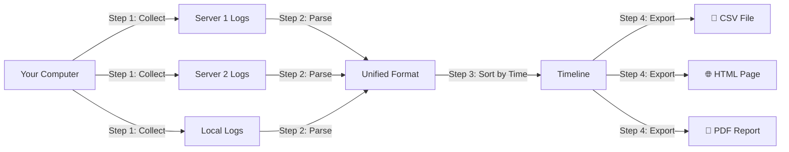

# 🎓 Forensic Timeline Builder - Complete Beginner's Guide

## 📖 What Is This Project?

Imagine you're a detective investigating a computer security incident. You need to know **what happened, when it happened, and on which computer**. But the problem is:

- You have **multiple computers** (servers, workstations, etc.)
- Each computer has **different log files** (system logs, authentication logs, etc.)
- The logs are in **different formats** (Linux logs, Windows logs, etc.)
- The logs are **scattered** across different machines

**This tool solves that problem!** It:
1. **Collects** all the logs from different computers
2. **Translates** them into one common format
3. **Sorts** everything by time
4. **Creates reports** you can read (CSV, HTML, PDF)

Think of it like gathering puzzle pieces from different boxes and arranging them in order to see the complete picture.

---

## 🎯 Real-World Example

### The Scenario
Let's say someone tried to hack into your company's servers on March 10th, 2025. You need to investigate:

**Without this tool:**
- Log into Server 1, download logs manually
- Log into Server 2, download logs manually  
- Log into Server 3, download logs manually
- Open each log file separately
- Try to figure out the timeline by hand
- Spend hours correlating events

**With this tool:**
- Run ONE command: `python run_all.py`
- Get a unified timeline of ALL events from ALL servers
- See exactly what happened in chronological order
- Export to Excel/PDF for your report

---

## 🏗️ How Does It Work? (Simple Explanation)



### The 4 Steps Explained:

#### **Step 1: Collection** 🔍
The tool connects to your servers (via SSH) or reads local files and downloads log files.

**Example:**
```
Connecting to 192.168.1.10...
Downloading /var/log/syslog... ✓
Downloading /var/log/auth.log... ✓
```

#### **Step 2: Parsing** 📝
Each log file has a different format. The tool reads each one and extracts:
- **When** did it happen? (timestamp)
- **Where** did it happen? (which computer)
- **What** happened? (the event message)

**Example Log Line:**
```
Mar 10 12:34:56 server1 sshd[12345]: Accepted password for alice from 10.0.0.5
```

**Parsed Into:**
- Timestamp: `2025-03-10 12:34:56`
- Host: `192.168.1.10`
- Message: `Accepted password for alice from 10.0.0.5`

#### **Step 3: Normalization** 🔄
All events from all servers are combined into ONE big table and sorted by time.

**Result:**
```
| Time                | Host          | Event                                    |
|---------------------|---------------|------------------------------------------|
| 2025-03-10 12:34:56 | 192.168.1.10  | Accepted password for alice from 10.0.0.5|
| 2025-03-10 12:35:02 | 192.168.1.15  | sudo: alice : COMMAND=/bin/ls            |
| 2025-03-10 12:36:10 | test.local    | CRON[24346]: (root) CMD (run-parts...)   |
```

#### **Step 4: Export** 📊
The timeline is saved in multiple formats:
- **CSV** - Open in Excel for analysis
- **HTML** - View in web browser (what you saw in the screenshot!)
- **PDF** - Print for reports

---

## 🗂️ Project Structure (What Each File Does)

```
forensic-timeline-builder/
│
├── 📁 collector/                    ← STEP 1: Gets the logs
│   ├── collect_logs.py             ← Main script that downloads logs
│   ├── ssh_hosts.json              ← Configuration: which servers to connect to
│   └── sample_local_logs/          ← Sample logs for testing
│
├── 📁 processor/                    ← STEP 2 & 3: Processes the logs
│   ├── normalize.py                ← Combines all logs into one timeline
│   ├── timeline_builder.py         ← Creates the output files
│   └── parsers/                    ← Translators for different log types
│       ├── syslog_parser.py        ← Understands Linux syslog format
│       ├── authlog_parser.py       ← Understands authentication logs
│       └── windows_evtx_parser.py  ← Understands Windows Event Logs
│
├── 📁 webui/                        ← BONUS: Web interface
│   ├── app.py                      ← Web server (what you saw in browser)
│   └── templates/                  ← HTML pages
│
├── 📁 output/                       ← STEP 4: Where results are saved
│   ├── raw_logs/                   ← Downloaded logs (organized by server)
│   ├── final_timeline.csv          ← Excel-friendly timeline
│   ├── timeline.html               ← Web page timeline
│   └── timeline.pdf                ← Printable timeline
│
├── run_all.py                       ← 🚀 MAIN SCRIPT - Run this!
├── requirements.txt                 ← List of Python libraries needed
└── README.md                        ← Documentation
```

---

## 🚀 How to Use It (Step-by-Step Tutorial)

### Prerequisites
Before you start, make sure you have:
- ✅ Python 3.11 or newer installed
- ✅ Internet connection (to install libraries)
- ✅ Access to servers you want to collect logs from (optional)

---

### Tutorial 1: Running Your First Timeline (Using Sample Data)

This tutorial uses the included sample logs, so you don't need any servers!

#### Step 1: Open Terminal
```powershell
cd C:\Users\abhis\Downloads\forensic-timeline-builder
```

#### Step 2: Check Configuration
Open `collector/ssh_hosts.json` - you should see:

```json
[
  {
    "host": "192.168.1.10",
    "user": "admin",
    "password": "password",
    "paths": ["/var/log/syslog", "/var/log/auth.log"]
  },
  {
    "host": "test.local",
    "local_path": ["collector/sample_local_logs/syslog_sample.log"]
  }
]
```

**What this means:**
- First entry: Try to connect to server `192.168.1.10` (will timeout - that's OK!)
- Second entry: Use local sample file from `collector/sample_local_logs/`

#### Step 3: Run the Tool
```powershell
python run_all.py
```

**What you'll see:**
```
[1] Collecting logs from hosts
[-] SSH connect failed for 192.168.1.10: timed out    ← Expected! No real server
[-] SSH connect failed for 192.168.1.15: timed out    ← Expected! No real server
[+] Copied local file ... → output/raw_logs/test_local/syslog_sample.log  ← Success!
[2] Normalizing logs
[3] Building timeline exports
[+] CSV exported → output/final_timeline.csv
[+] HTML exported → output/timeline.html
[+] PDF exported → output/timeline.pdf
[DONE] All tasks complete
```

#### Step 4: View the Results

**Option A: Excel/CSV**
```powershell
# Open in Excel
start output/final_timeline.csv
```

**Option B: Web Browser**
```powershell
# Open HTML file
start output/timeline.html
```

**Option C: Web Interface (What you saw in screenshot)**
```powershell
# Start web server
python webui/app.py

# Then open browser to: http://127.0.0.1:8080
```

---

### Tutorial 2: Collecting Logs from Real Servers

Now let's collect logs from actual servers!

#### Step 1: Edit Configuration
Open `collector/ssh_hosts.json` and modify:

```json
[
  {
    "host": "192.168.1.100",           ← Your server's IP
    "user": "your_username",           ← Your SSH username
    "password": "your_password",       ← Your SSH password
    "paths": [                         ← Which logs to collect
      "/var/log/syslog",
      "/var/log/auth.log"
    ]
  }
]
```

#### Step 2: Test Connection
First, make sure you can SSH to the server manually:
```powershell
ssh your_username@192.168.1.100
```

If that works, the tool will work too!

#### Step 3: Run Collection
```powershell
python run_all.py
```

#### Step 4: Check Output
```powershell
# See what was collected
dir output\raw_logs\192_168_1_100\
```

---

### Tutorial 3: Analyzing the Timeline

Once you have a timeline, here's how to analyze it:

#### Using Excel (CSV file)
1. Open `output/final_timeline.csv` in Excel
2. Use **Filter** feature to search for specific events
3. Use **Sort** to organize by host or time
4. Create **PivotTables** for summary statistics

**Example Searches:**
- Find all "failed" login attempts: Filter "message" column for "failed"
- Find all events from one server: Filter "host" column
- Find events in a time range: Filter "timestamp" column

#### Using Web Interface
1. Start the web server: `python webui/app.py`
2. Open browser to `http://127.0.0.1:8080`
3. Use browser's Find feature (Ctrl+F) to search
4. Scroll through chronological events

#### Using Python (Advanced)
```python
import pandas as pd

# Load the timeline
df = pd.read_csv('output/final_timeline.csv')

# Find failed login attempts
failed_logins = df[df['message'].str.contains('failed', case=False, na=False)]
print(f"Found {len(failed_logins)} failed login attempts")

# Find events from specific host
server_events = df[df['host'] == '192.168.1.10']
print(f"Server 192.168.1.10 had {len(server_events)} events")

# Find events in time range
df['timestamp'] = pd.to_datetime(df['timestamp'])
recent = df[df['timestamp'] > '2025-03-10']
print(f"Found {len(recent)} recent events")
```

---

## 🔧 Common Tasks

### Task 1: Add a New Server to Monitor

**Edit `collector/ssh_hosts.json`:**
```json
[
  {
    "host": "new-server.example.com",
    "user": "admin",
    "password": "secret123",
    "paths": ["/var/log/syslog"]
  }
]
```

**Run:**
```powershell
python run_all.py
```

### Task 2: Collect Only (Don't Process)

```powershell
python collector/collect_logs.py
```

This only downloads logs to `output/raw_logs/` without processing.

### Task 3: Process Existing Logs

```powershell
python processor/normalize.py
```

This processes logs already in `output/raw_logs/` without downloading new ones.

### Task 4: Export Custom Timeline

```python
from processor.normalize import normalize_all
from processor.timeline_builder import build_timeline_csv

# Get all events
df = normalize_all()

# Filter to specific host
filtered = df[df['host'] == '192.168.1.10']

# Export filtered timeline
build_timeline_csv(filtered)
```

---

## 🎨 Understanding the Web Interface

The screenshot you showed is the **Web Interface**. Let me explain what you're seeing:

### Header
```
Forensic Timeline Viewer
```
This is the title of the web page.

### The Table
Each row is one event with these columns:

| Column | What It Means | Example |
|--------|---------------|---------|
| **timestamp** | When the event happened | `2025-03-10 12:34:56+00:00` |
| **message** | What happened | `sshd[12345]: Accepted password for alice` |
| **host** | Which computer | `test.local` |
| **raw** | Original log line | `Mar 10 12:34:56 host1 sshd[12345]: Accepted...` |

### How to Use It

1. **Start the server:**
   ```powershell
   python webui/app.py
   ```

2. **Open browser to:** `http://127.0.0.1:8080`

3. **Search events:** Press `Ctrl+F` and type keywords like "failed", "error", "alice"

4. **Refresh data:** Re-run `python run_all.py` then refresh the browser page

---

## 🐛 Troubleshooting

### Problem: "No module named 'evtx'"
**Solution:**
```powershell
pip install -r requirements.txt
```

### Problem: "SSH connect failed: timed out"
**Possible causes:**
- Server is not reachable (check with `ping <server-ip>`)
- Firewall blocking SSH (port 22)
- Wrong IP address in `ssh_hosts.json`
- SSH service not running on server

**Solution:** Verify server is accessible:
```powershell
ping 192.168.1.10
ssh username@192.168.1.10
```

### Problem: "No events found after normalization"
**Possible causes:**
- No logs were collected (check `output/raw_logs/` folder)
- Log format not recognized by parsers

**Solution:** Check if logs were downloaded:
```powershell
dir output\raw_logs\
```

### Problem: Web interface shows "No timeline generated yet"
**Solution:** Run the main script first:
```powershell
python run_all.py
```

---

## 📚 Next Steps

### Beginner Level ✅
- [x] Understand what the tool does
- [x] Run with sample data
- [x] View timeline in browser
- [ ] Collect logs from one real server
- [ ] Search for specific events

### Intermediate Level 🔨
- [ ] Collect from multiple servers
- [ ] Filter timeline by time range
- [ ] Export custom reports
- [ ] Schedule automatic collection (cron/Task Scheduler)

### Advanced Level 🚀
- [ ] Write custom parsers for new log formats
- [ ] Integrate with SIEM tools
- [ ] Add email alerts for suspicious events
- [ ] Create custom visualizations

---

## 💡 Pro Tips

### Tip 1: Use SSH Keys Instead of Passwords
More secure than storing passwords in JSON:
```json
{
  "host": "server.example.com",
  "user": "admin",
  "key_file": "/path/to/private_key"
}
```

### Tip 2: Automate Daily Collection
**Windows Task Scheduler:**
```powershell
schtasks /create /tn "DailyLogCollection" /tr "python C:\path\to\run_all.py" /sc daily /st 02:00
```

**Linux Cron:**
```bash
0 2 * * * cd /path/to/forensic-timeline-builder && python run_all.py
```

### Tip 3: Keep Historical Data
Create dated backups:
```powershell
# Before running, backup previous timeline
copy output\final_timeline.csv output\timeline_2025-03-10.csv
python run_all.py
```

### Tip 4: Use for Compliance
Generate monthly reports for auditors:
```python
# Filter to last month
import pandas as pd
df = pd.read_csv('output/final_timeline.csv')
df['timestamp'] = pd.to_datetime(df['timestamp'])
last_month = df[df['timestamp'] >= '2025-02-01']
last_month.to_csv('output/february_2025_audit.csv', index=False)
```

---

## 🎓 Learning Resources

### Understanding Log Files
- **Syslog**: System events (startup, shutdown, errors)
- **Auth.log**: Login attempts, sudo commands, SSH connections
- **Windows Event Logs**: Security events, application errors

### Forensic Analysis Basics
1. **Timeline Analysis**: Reconstruct sequence of events
2. **Correlation**: Connect related events across systems
3. **Anomaly Detection**: Find unusual patterns
4. **Evidence Collection**: Preserve logs for investigation

### Python Skills to Learn
- **Pandas**: Data manipulation and analysis
- **SSH/Paramiko**: Remote server connections
- **Flask**: Web application development
- **Datetime**: Working with timestamps

---

## ❓ Frequently Asked Questions

**Q: Is this tool only for security incidents?**
A: No! Use it for:
- Troubleshooting system issues
- Compliance auditing
- Performance analysis
- General log aggregation

**Q: Can I use it with Windows servers?**
A: Yes! It supports Windows Event Logs (.evtx files). You can either:
- Copy .evtx files locally and use `local_path`
- Use Windows Remote Management (requires additional setup)

**Q: How much disk space do I need?**
A: Depends on log size. Typical usage:
- Small environment (5 servers): ~100 MB
- Medium environment (50 servers): ~1 GB
- Large environment (500 servers): ~10 GB

**Q: Can I run this on Linux/Mac?**
A: Yes! It's cross-platform Python. Just use forward slashes `/` in paths.

**Q: Is it safe to store passwords in JSON?**
A: No! For production use:
- Use SSH keys instead
- Use environment variables
- Use a secrets management tool

---

## 🎉 Congratulations!

You now understand:
- ✅ What the Forensic Timeline Builder does
- ✅ How it works (4-step process)
- ✅ How to run it with sample data
- ✅ How to collect from real servers
- ✅ How to analyze the timeline
- ✅ How to troubleshoot common issues

**Ready to try it yourself?** Start with Tutorial 1 and work your way up!

---

**Need Help?** Check the detailed documentation:
- `README.md` - Quick reference guide
- `DOCUMENTATION.md` - Technical deep-dive

**Happy Investigating! 🔍🔐**
