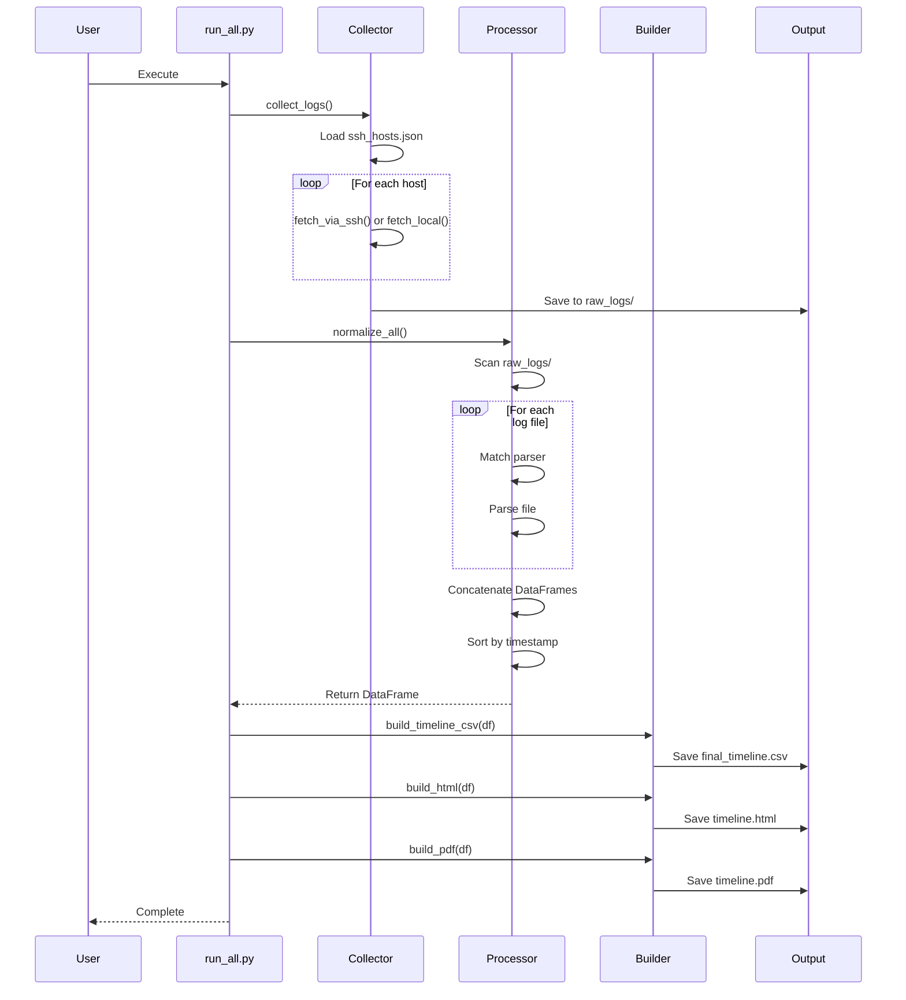

# 📚 Forensic Timeline Builder - Technical Documentation

## Table of Contents

1. [System Architecture](#system-architecture)
2. [Component Details](#component-details)
3. [Data Flow](#data-flow)
4. [API Reference](#api-reference)
5. [Parser Development Guide](#parser-development-guide)
6. [Configuration Reference](#configuration-reference)
7. [Advanced Usage](#advanced-usage)
8. [Performance Optimization](#performance-optimization)
9. [Security Considerations](#security-considerations)

---

## 1. System Architecture

### Overview

The Forensic Timeline Builder follows a modular pipeline architecture with three main stages:

1. **Collection Stage**: Gather logs from multiple sources
2. **Processing Stage**: Parse and normalize logs into unified format
3. **Export Stage**: Generate output in multiple formats

### Design Principles

- **Modularity**: Each component is independent and replaceable
- **Extensibility**: Easy to add new parsers and exporters
- **Robustness**: Graceful error handling and recovery
- **Path Independence**: Works regardless of execution location

### Technology Stack

| Component | Technology | Purpose |
|-----------|-----------|---------|
| Core Language | Python 3.11+ | Main implementation |
| SSH/SFTP | Paramiko | Remote log collection |
| Data Processing | Pandas | DataFrame operations |
| Date Parsing | python-dateutil | Flexible timestamp parsing |
| Windows Logs | evtx | EVTX file parsing |
| Web UI | Flask | Timeline visualization |
| PDF Export | pdfkit + matplotlib | Report generation |

---

## 2. Component Details

### 2.1 Collector Module (`collector/`)

#### Purpose
Collect log files from remote hosts via SSH/SFTP or from local filesystem.

#### Main Script: `collect_logs.py`

**Key Functions:**

##### `fetch_via_ssh(host, user, password, paths, timeout=10)`
Connects to remote host via SSH and downloads specified log files.

**Parameters:**
- `host` (str): IP address or hostname
- `user` (str): SSH username
- `password` (str): SSH password
- `paths` (list): List of remote file paths to download
- `timeout` (int): Connection timeout in seconds

**Returns:** None (prints status messages)

**Error Handling:**
- Connection failures: Logs error and continues to next host
- File not found: Logs error and continues to next file
- SFTP errors: Closes connection gracefully

**Example:**
```python
fetch_via_ssh(
    host="192.168.1.10",
    user="admin",
    password="secret",
    paths=["/var/log/syslog", "/var/log/auth.log"]
)
```

##### `fetch_local(host, local_paths)`
Copies files from local filesystem to output directory.

**Path Resolution Strategy:**
1. Try absolute path as provided
2. Try relative to `collector/` directory
3. Try relative to project root
4. Try stripping leading `collector/` prefix

**Parameters:**
- `host` (str): Logical hostname for organization
- `local_paths` (list): List of local file/directory paths

**Example:**
```python
fetch_local(
    host="test.local",
    local_paths=["collector/sample_local_logs/syslog_sample.log"]
)
```

##### `load_hosts(json_path)`
Loads host configuration from JSON file.

**Returns:** List of host configuration dictionaries

#### Configuration: `ssh_hosts.json`

**Schema:**

```json
[
  {
    "host": "string (required)",
    "user": "string (required for SSH)",
    "password": "string (required for SSH)",
    "paths": ["array of strings (required for SSH)"],
    "local_path": ["array of strings (for local files)"]
  }
]
```

**Notes:**
- Either `paths` (SSH) or `local_path` (local) must be specified
- `local_path` entries skip SSH connection
- Multiple entries can have the same host

#### Output Structure

```
output/raw_logs/
├── 192_168_1_10/          # Dots replaced with underscores
│   ├── syslog
│   └── auth.log
├── 192_168_1_15/
│   └── syslog
└── test_local/
    └── syslog_sample.log
```

---

### 2.2 Processor Module (`processor/`)

#### Purpose
Parse raw logs and normalize into unified timeline format.

#### Main Script: `normalize.py`

##### `normalize_all()`
Main orchestration function that processes all collected logs.

**Process:**
1. Scan `output/raw_logs/` for host directories
2. For each log file, match against parser registry
3. Apply appropriate parser
4. Concatenate all parsed DataFrames
5. Convert timestamps to UTC
6. Sort by timestamp
7. Return unified DataFrame

**Returns:** `pd.DataFrame` with columns:
- `timestamp` (datetime): UTC timestamp
- `host` (str): Source hostname
- `message` (str): Parsed message
- `raw` (str): Original log line

**Example:**
```python
from processor.normalize import normalize_all

df = normalize_all()
print(f"Total events: {len(df)}")
print(df.head())
```

#### Parser Registry: `EXT_MAP`

Maps file patterns to parser functions:

```python
EXT_MAP = {
    "syslog": parse_syslog,
    "auth.log": parse_authlog,
    "evtx": parse_evtx
}
```

**Matching Logic:**
- Uses substring matching: `if key in log_file`
- First match wins
- Case-sensitive

---

### 2.3 Parser Modules (`processor/parsers/`)

All parsers follow a common interface:

```python
def parse_<type>(file_path: str, host: str) -> pd.DataFrame:
    """
    Parse log file and return normalized DataFrame.
    
    Args:
        file_path: Absolute path to log file
        host: Hostname for this log
        
    Returns:
        DataFrame with columns: timestamp, message, host, raw
    """
```

#### Syslog Parser (`syslog_parser.py`)

**Format Expected:**
```
Jan 15 10:30:45 hostname process[pid]: message
```

**Parsing Strategy:**
1. Split line into tokens
2. First 3 tokens = timestamp
3. 4th token = process/pid
4. Remaining = message

**Error Handling:**
- Unparseable lines are skipped silently
- Uses `errors="ignore"` for encoding issues

#### Auth.log Parser (`authlog_parser.py`)

Similar to syslog parser, specialized for authentication events.

**Common Patterns:**
- SSH login attempts
- sudo commands
- User authentication events

#### Windows EVTX Parser (`windows_evtx_parser.py`)

**Dependencies:** `evtx` library (PyEvtxParser)

**Process:**
1. Open EVTX file with PyEvtxParser
2. Iterate through records
3. Extract timestamp and event data
4. Convert to DataFrame

**Example:**
```python
from processor.parsers.windows_evtx_parser import parse_evtx

df = parse_evtx("Security.evtx", "windows-server-01")
```

---

### 2.4 Timeline Builder (`processor/timeline_builder.py`)

#### Purpose
Export normalized timeline to multiple formats.

#### Key Functions

##### `build_timeline_csv(events_df)`
Export timeline to CSV format.

**Output:** `output/final_timeline.csv`

**Features:**
- No index column
- UTF-8 encoding
- Compatible with Excel, Splunk, etc.

##### `build_html(events_df)`
Export timeline to HTML table.

**Output:** `output/timeline.html`

**Features:**
- Standalone HTML file
- No index column
- Can be opened in any browser

##### `build_pdf(events_df)`
Export timeline visualization to PDF.

**Output:** `output/timeline.pdf`

**Current Implementation:**
- Simple matplotlib plot (placeholder)
- Can be enhanced with better layouts

**Enhancement Ideas:**
```python
def build_pdf(events_df: pd.DataFrame):
    # Create multi-page PDF with event details
    # Add timeline visualization
    # Include summary statistics
    # Add host breakdown charts
```

---

### 2.5 Web UI Module (`webui/`)

#### Flask Application (`app.py`)

**Routes:**

##### `GET /`
Display timeline in web interface.

**Process:**
1. Load `output/final_timeline.csv`
2. Convert to HTML table
3. Render template with data

**Error Handling:**
- If CSV doesn't exist, show friendly message
- Graceful degradation

**Starting the Server:**
```bash
python webui/app.py
```

**Configuration:**
- Host: `0.0.0.0` (all interfaces)
- Port: `8080`
- Debug: `True` (disable in production)

#### Templates (`templates/timeline.html`)

Basic HTML template that displays timeline table.

**Customization:**
- Add CSS styling
- Add JavaScript for filtering/searching
- Add export buttons
- Add date range selectors

---

## 3. Data Flow

### Complete Pipeline Flow



### Data Transformation

**Stage 1: Raw Logs**
```
Jan 15 10:30:45 server1 sshd[1234]: Accepted password for user from 192.168.1.100
```

**Stage 2: Parsed Event**
```python
{
    "timestamp": datetime(2025, 1, 15, 10, 30, 45),
    "host": "192.168.1.10",
    "message": "Accepted password for user from 192.168.1.100",
    "raw": "Jan 15 10:30:45 server1 sshd[1234]: Accepted password for user from 192.168.1.100"
}
```

**Stage 3: Normalized DataFrame**
```
| timestamp           | host          | message                                    | raw                |
|---------------------|---------------|--------------------------------------------|--------------------|
| 2025-01-15 10:30:45 | 192.168.1.10  | Accepted password for user from 192...     | Jan 15 10:30:45... |
```

---

## 4. API Reference

### Collector API

```python
from collector.collect_logs import fetch_via_ssh, fetch_local, load_hosts

# Load configuration
hosts = load_hosts(Path("collector/ssh_hosts.json"))

# Collect from SSH host
fetch_via_ssh(
    host="192.168.1.10",
    user="admin",
    password="password",
    paths=["/var/log/syslog"],
    timeout=10
)

# Collect local files
fetch_local(
    host="localhost",
    local_paths=["logs/application.log"]
)
```

### Processor API

```python
from processor.normalize import normalize_all
from processor.timeline_builder import build_timeline_csv, build_html, build_pdf
import pandas as pd

# Normalize all logs
df = normalize_all()

# Filter events
filtered_df = df[df['host'] == '192.168.1.10']

# Export
build_timeline_csv(filtered_df)
build_html(filtered_df)
build_pdf(filtered_df)
```

### Parser API

```python
from processor.parsers.syslog_parser import parse_syslog

# Parse single file
df = parse_syslog("/path/to/syslog", "hostname")

# Access events
for idx, row in df.iterrows():
    print(f"{row['timestamp']}: {row['message']}")
```

---

## 5. Parser Development Guide

### Creating a Custom Parser

#### Step 1: Create Parser File

Create `processor/parsers/my_parser.py`:

```python
import pandas as pd
from dateutil import parser as date_parser

def parse_my_format(file_path: str, host: str) -> pd.DataFrame:
    """
    Parse custom log format.
    
    Expected format:
    [YYYY-MM-DD HH:MM:SS] LEVEL: message
    
    Args:
        file_path: Path to log file
        host: Hostname
        
    Returns:
        DataFrame with normalized events
    """
    events = []
    
    with open(file_path, "r", errors="ignore") as f:
        for line_num, line in enumerate(f, 1):
            try:
                # Extract timestamp
                if not line.startswith("["):
                    continue
                    
                timestamp_str = line[1:20]  # [YYYY-MM-DD HH:MM:SS]
                timestamp = date_parser.parse(timestamp_str)
                
                # Extract level and message
                rest = line[22:]  # Skip "] "
                if ":" in rest:
                    level, message = rest.split(":", 1)
                    message = f"[{level.strip()}] {message.strip()}"
                else:
                    message = rest.strip()
                
                events.append({
                    "timestamp": timestamp,
                    "message": message,
                    "host": host,
                    "raw": line.strip()
                })
                
            except Exception as e:
                # Log parsing errors for debugging
                print(f"[WARN] Failed to parse line {line_num} in {file_path}: {e}")
                continue
    
    return pd.DataFrame(events)
```

#### Step 2: Register Parser

Edit `processor/normalize.py`:

```python
from processor.parsers.my_parser import parse_my_format

EXT_MAP = {
    "syslog": parse_syslog,
    "auth.log": parse_authlog,
    "evtx": parse_evtx,
    "myapp.log": parse_my_format  # Add your parser
}
```

#### Step 3: Test Parser

```python
# Test standalone
from processor.parsers.my_parser import parse_my_format

df = parse_my_format("test_logs/myapp.log", "test-host")
print(df.head())
print(f"Parsed {len(df)} events")
```

### Parser Best Practices

1. **Error Handling**: Always wrap parsing in try-except
2. **Encoding**: Use `errors="ignore"` for file reading
3. **Validation**: Validate required fields before creating event
4. **Logging**: Print warnings for unparseable lines
5. **Performance**: Use generators for large files
6. **Testing**: Test with various log formats and edge cases

---

## 6. Configuration Reference

### Environment Variables

Currently not used, but can be added:

```python
import os

# In collect_logs.py
SSH_TIMEOUT = int(os.getenv("SSH_TIMEOUT", "10"))
OUTPUT_DIR = Path(os.getenv("OUTPUT_DIR", "output/raw_logs"))
```

### Configuration Files

#### `ssh_hosts.json` Schema

```json
{
  "$schema": "http://json-schema.org/draft-07/schema#",
  "type": "array",
  "items": {
    "type": "object",
    "properties": {
      "host": {
        "type": "string",
        "description": "Hostname or IP address"
      },
      "user": {
        "type": "string",
        "description": "SSH username"
      },
      "password": {
        "type": "string",
        "description": "SSH password"
      },
      "paths": {
        "type": "array",
        "items": {"type": "string"},
        "description": "Remote file paths to collect"
      },
      "local_path": {
        "type": "array",
        "items": {"type": "string"},
        "description": "Local file paths to collect"
      }
    },
    "required": ["host"],
    "oneOf": [
      {"required": ["user", "password", "paths"]},
      {"required": ["local_path"]}
    ]
  }
}
```

---

## 7. Advanced Usage

### Filtering Events by Time Range

```python
from processor.normalize import normalize_all
import pandas as pd

df = normalize_all()

# Filter by date range
start_date = pd.to_datetime("2025-01-15")
end_date = pd.to_datetime("2025-01-16")

filtered = df[
    (df['timestamp'] >= start_date) & 
    (df['timestamp'] <= end_date)
]

print(f"Events in range: {len(filtered)}")
```

### Filtering by Host

```python
# Single host
host_events = df[df['host'] == '192.168.1.10']

# Multiple hosts
hosts_of_interest = ['192.168.1.10', '192.168.1.15']
multi_host = df[df['host'].isin(hosts_of_interest)]
```

### Searching for Specific Events

```python
# Search in messages
ssh_events = df[df['message'].str.contains('ssh', case=False, na=False)]

# Failed login attempts
failed_logins = df[df['message'].str.contains('failed', case=False, na=False)]

# Regex search
import re
pattern = r'failed.*login'
regex_match = df[df['message'].str.contains(pattern, case=False, regex=True, na=False)]
```

### Custom Export Formats

```python
from processor.normalize import normalize_all
import json

df = normalize_all()

# Export to JSON
df['timestamp'] = df['timestamp'].astype(str)
json_output = df.to_json(orient='records', indent=2)
with open('output/timeline.json', 'w') as f:
    f.write(json_output)

# Export to Excel
df.to_excel('output/timeline.xlsx', index=False)
```

### Automated Scheduling

**Windows Task Scheduler:**
```powershell
# Create scheduled task to run daily at 2 AM
schtasks /create /tn "ForensicTimeline" /tr "python C:\path\to\run_all.py" /sc daily /st 02:00
```

**Linux Cron:**
```bash
# Add to crontab
0 2 * * * cd /path/to/forensic-timeline-builder && python run_all.py
```

---

## 8. Performance Optimization

### Large Log Files

For files > 1GB, use chunked reading:

```python
def parse_large_syslog(file_path: str, host: str, chunk_size: int = 10000) -> pd.DataFrame:
    """Parse large syslog files in chunks."""
    chunks = []
    events = []
    
    with open(file_path, "r", errors="ignore") as f:
        for i, line in enumerate(f):
            # Parse line (same as before)
            # ...
            events.append(event_dict)
            
            # Process in chunks
            if len(events) >= chunk_size:
                chunks.append(pd.DataFrame(events))
                events = []
    
    # Add remaining events
    if events:
        chunks.append(pd.DataFrame(events))
    
    return pd.concat(chunks, ignore_index=True)
```

### Parallel Processing

```python
from concurrent.futures import ThreadPoolExecutor
from processor.normalize import EXT_MAP

def process_file(file_info):
    file_path, host, parser_fn = file_info
    return parser_fn(file_path, host)

def normalize_all_parallel():
    # Collect all files to process
    tasks = []
    for host_folder in os.listdir(RAW_DIR):
        for log_file in os.listdir(os.path.join(RAW_DIR, host_folder)):
            # Match parser and add to tasks
            # ...
            tasks.append((file_path, host, parser_fn))
    
    # Process in parallel
    with ThreadPoolExecutor(max_workers=4) as executor:
        results = executor.map(process_file, tasks)
    
    return pd.concat(results, ignore_index=True)
```

### Memory Optimization

```python
# Use categorical data types for repeated values
df['host'] = df['host'].astype('category')

# Drop raw column if not needed
df_compact = df.drop(columns=['raw'])

# Use efficient timestamp storage
df['timestamp'] = pd.to_datetime(df['timestamp'], utc=True)
```

---

## 9. Security Considerations

### Password Storage

**Current Implementation:** Passwords in plaintext JSON (not secure)

**Recommended Improvements:**

1. **Use SSH Keys:**
```python
def fetch_via_ssh_key(host, user, key_path, paths):
    ssh = paramiko.SSHClient()
    ssh.set_missing_host_key_policy(paramiko.AutoAddPolicy())
    
    private_key = paramiko.RSAKey.from_private_key_file(key_path)
    ssh.connect(hostname=host, username=user, pkey=private_key)
    # ... rest of implementation
```

2. **Environment Variables:**
```python
import os

password = os.getenv(f"SSH_PASSWORD_{host.replace('.', '_')}")
```

3. **Encrypted Configuration:**
```python
from cryptography.fernet import Fernet

def load_encrypted_config(config_path, key):
    cipher = Fernet(key)
    with open(config_path, 'rb') as f:
        encrypted = f.read()
    decrypted = cipher.decrypt(encrypted)
    return json.loads(decrypted)
```

### Network Security

- Use VPN for remote collection
- Implement connection rate limiting
- Add IP whitelisting
- Use SSH key authentication
- Enable SSH connection logging

### Data Protection

- Sanitize sensitive data before export
- Encrypt output files
- Implement access controls
- Secure deletion of raw logs after processing

---

## Appendix A: Troubleshooting Matrix

| Symptom | Possible Cause | Solution |
|---------|---------------|----------|
| No logs collected | Wrong credentials | Verify ssh_hosts.json |
| Empty timeline | Parser mismatch | Check log file names match EXT_MAP |
| Timestamp errors | Invalid date format | Update parser date extraction |
| Memory errors | Large log files | Use chunked processing |
| PDF generation fails | Missing wkhtmltopdf | Install wkhtmltopdf or use HTML |
| Web UI shows no data | CSV not generated | Run run_all.py first |

---

## Appendix B: Example Workflows

### Workflow 1: Incident Response

```python
# 1. Collect logs from compromised systems
# Update ssh_hosts.json with incident hosts

# 2. Run collection
python run_all.py

# 3. Filter suspicious events
from processor.normalize import normalize_all
df = normalize_all()

# Find failed login attempts
failed = df[df['message'].str.contains('failed', case=False, na=False)]

# Find events around incident time
incident_time = pd.to_datetime("2025-01-15 14:30:00")
window = pd.Timedelta(hours=2)
incident_events = df[
    (df['timestamp'] >= incident_time - window) &
    (df['timestamp'] <= incident_time + window)
]

# Export incident timeline
incident_events.to_csv('output/incident_timeline.csv', index=False)
```

### Workflow 2: Compliance Audit

```python
# Collect logs from all systems
# Generate monthly timeline
# Export to PDF for audit records

from processor.normalize import normalize_all
from processor.timeline_builder import build_pdf
import pandas as pd

df = normalize_all()

# Filter to last month
last_month = pd.Timestamp.now() - pd.DateOffset(months=1)
monthly = df[df['timestamp'] >= last_month]

# Generate audit report
build_pdf(monthly)
```

---

**End of Technical Documentation**
