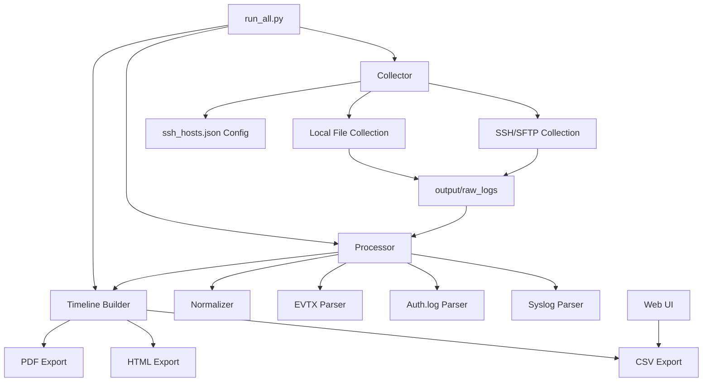

# 🔍 Forensic Timeline Builder

A comprehensive Python-based forensic analysis tool that collects logs from multiple sources (local and remote), normalizes them into a unified timeline, and generates multiple output formats for analysis.


## 📋 Table of Contents

- [Overview](#overview)
- [Features](#features)
- [Architecture](#architecture)
- [Installation](#installation)
- [Quick Start](#quick-start)
- [Configuration](#configuration)
- [Usage](#usage)
- [Output Formats](#output-formats)
- [Project Structure](#project-structure)
- [Troubleshooting](#troubleshooting)
- [Contributing](#contributing)

## 🎯 Overview

The Forensic Timeline Builder is designed for security analysts, incident responders, and forensic investigators who need to:

- Collect logs from multiple hosts (Windows and Linux)
- Normalize disparate log formats into a unified timeline
- Analyze events chronologically across multiple systems
- Generate reports in multiple formats (CSV, HTML, PDF)
- Visualize timelines through a web interface

## ✨ Features

### Log Collection
- **SSH/SFTP Support**: Remotely collect logs from Linux/Unix systems
- **Local File Support**: Process logs from local directories
- **Multi-Host**: Collect from unlimited number of hosts simultaneously
- **Flexible Paths**: Support for both absolute and relative paths

### Log Parsing
- **Syslog Parser**: Parse standard Linux syslog files
- **Auth.log Parser**: Parse authentication logs
- **Windows Event Log Parser**: Parse Windows EVTX files
- **Extensible**: Easy to add new parsers for different log formats

### Timeline Generation
- **Unified Timeline**: Merge all logs into a single chronological timeline
- **Multiple Formats**: Export to CSV, HTML, and PDF
- **Timestamp Normalization**: Convert all timestamps to UTC
- **Sorted Output**: Events automatically sorted by timestamp

### Web Interface
- **Flask-based UI**: View timelines in your browser
- **Interactive Tables**: Browse and search through events
- **Real-time Updates**: Refresh to see latest timeline data

## 🏗️ Architecture



## 🚀 Installation

### Prerequisites

- Python 3.11 or higher
- pip (Python package manager)
- wkhtmltopdf (for PDF generation - optional)

### Step 1: Clone or Download

```bash
cd forensic-timeline-builder
```

### Step 2: Install Dependencies

```bash
pip install -r requirements.txt
```

### Dependencies Installed:
- `paramiko` - SSH/SFTP client
- `pandas` - Data manipulation and analysis
- `matplotlib` - Plotting and visualization
- `Flask` - Web framework for UI
- `evtx` - Windows Event Log parser
- `python-dateutil` - Date parsing utilities
- `pdfkit` - PDF generation

## ⚡ Quick Start

### 1. Configure Hosts

Edit `collector/ssh_hosts.json` to specify which hosts to collect logs from:

```json
[
  {
    "host": "192.168.1.10",
    "user": "admin",
    "password": "password",
    "paths": ["/var/log/syslog", "/var/log/auth.log"]
  },
  {
    "host": "test.local",
    "local_path": ["collector/sample_local_logs/syslog_sample.log"]
  }
]
```

### 2. Run the Pipeline

```bash
python run_all.py
```

This will:
1. ✅ Collect logs from all configured hosts
2. ✅ Parse and normalize all log files
3. ✅ Generate timeline in CSV, HTML, and PDF formats

### 3. View Results

**Option A: Check Output Files**
```bash
# Navigate to output directory
cd output

# View files
dir
```

**Option B: Use Web Interface**
```bash
# Start the web server
python webui/app.py

# Open browser to http://localhost:8080
```

## ⚙️ Configuration

### SSH Hosts Configuration (`collector/ssh_hosts.json`)

The configuration file supports two types of entries:

#### Remote SSH Host
```json
{
  "host": "192.168.1.10",
  "user": "admin",
  "password": "password",
  "paths": ["/var/log/syslog", "/var/log/auth.log"]
}
```

#### Local Files
```json
{
  "host": "test.local",
  "local_path": ["collector/sample_local_logs/syslog_sample.log"]
}
```

### Supported Log Types

| Log Type | File Pattern | Parser | Description |
|----------|-------------|--------|-------------|
| Syslog | `*syslog*` | `syslog_parser.py` | Standard Linux system logs |
| Auth Log | `*auth.log*` | `authlog_parser.py` | Authentication logs |
| Windows Event | `*.evtx` | `windows_evtx_parser.py` | Windows Event Logs |

## 📖 Usage

### Running Individual Components

#### Collect Logs Only
```bash
python collector/collect_logs.py
```

#### Normalize Logs Only
```bash
python processor/normalize.py
```

#### Generate Timeline from Existing Data
```python
from processor.normalize import normalize_all
from processor.timeline_builder import build_timeline_csv, build_html, build_pdf

df = normalize_all()
build_timeline_csv(df)
build_html(df)
build_pdf(df)
```

### Web Interface

Start the Flask web server:
```bash
python webui/app.py
```

Access the timeline at: `http://localhost:8080`

The web interface will automatically load the latest timeline from `output/final_timeline.csv`.

## 📊 Output Formats

All output files are saved to the `output/` directory:

### 1. CSV Format (`final_timeline.csv`)
- Machine-readable format
- Easy to import into Excel, Splunk, or other tools
- Contains: timestamp, host, message, raw log line

### 2. HTML Format (`timeline.html`)
- Human-readable table format
- Can be opened in any web browser
- Searchable using browser's find function

### 3. PDF Format (`timeline.pdf`)
- Printable format
- Contains visualization of timeline
- Suitable for reports and documentation

### 4. Raw Logs (`raw_logs/`)
- Original log files organized by host
- Preserved for reference and re-processing
- Directory structure: `raw_logs/<host>/`

## 📁 Project Structure

```
forensic-timeline-builder/
│
├── collector/                      # Log collection module
│   ├── __init__.py
│   ├── collect_logs.py            # Main collection script
│   ├── ssh_hosts.json             # Host configuration
│   └── sample_local_logs/         # Sample log files for testing
│       └── syslog_sample.log
│
├── processor/                      # Log processing module
│   ├── __init__.py
│   ├── normalize.py               # Main normalization script
│   ├── timeline_builder.py        # Timeline export functions
│   └── parsers/                   # Log format parsers
│       ├── __init__.py
│       ├── syslog_parser.py       # Syslog parser
│       ├── authlog_parser.py      # Auth.log parser
│       └── windows_evtx_parser.py # Windows EVTX parser
│
├── webui/                          # Web interface
│   ├── app.py                     # Flask application
│   ├── templates/                 # HTML templates
│   │   └── timeline.html
│   └── static/                    # CSS, JS, images
│       └── style.css
│
├── output/                         # Generated output
│   ├── raw_logs/                  # Collected raw logs
│   │   └── <host>/                # Per-host directories
│   ├── final_timeline.csv         # CSV timeline
│   ├── timeline.html              # HTML timeline
│   └── timeline.pdf               # PDF timeline
│
├── requirements.txt                # Python dependencies
├── run_all.py                     # Main execution script
├── README.md                      # This file
└── DOCUMENTATION.md               # Detailed technical documentation
```

## 🔧 Troubleshooting

### Common Issues

#### 1. ModuleNotFoundError: No module named 'evtx'

**Solution:**
```bash
pip install -r requirements.txt
```

#### 2. OSError: Cannot save file into a non-existent directory

**Solution:** The output directory structure is automatically created. If you see this error, ensure you're running the script from the project root:
```bash
cd forensic-timeline-builder
python run_all.py
```

#### 3. SSH Connection Timeout

**Symptoms:** `[-] SSH connect failed for <host>: timed out`

**Solutions:**
- Verify the host is reachable: `ping <host>`
- Check firewall settings
- Verify SSH credentials in `ssh_hosts.json`
- Ensure SSH service is running on the target host

#### 4. Permission Denied on Remote Host

**Solution:**
- Verify user has read permissions for log files
- Try using sudo or a privileged user
- Check file paths in `ssh_hosts.json`

#### 5. No Events Found After Normalization

**Possible Causes:**
- No logs were collected
- Log format not recognized
- Parser failed to extract events

**Solution:**
- Check `output/raw_logs/` to verify logs were collected
- Review parser code for your log format
- Check console output for parser errors

### Debug Mode

Enable verbose output by modifying `run_all.py`:

```python
import logging
logging.basicConfig(level=logging.DEBUG)
```

## 🤝 Contributing

### Adding a New Parser

1. Create a new parser file in `processor/parsers/`:

```python
# processor/parsers/my_custom_parser.py
import pandas as pd

def parse_my_log(file_path, host):
    events = []
    with open(file_path, "r", errors="ignore") as f:
        for line in f:
            # Parse your log format
            events.append({
                "timestamp": parsed_timestamp,
                "message": parsed_message,
                "host": host,
                "raw": line.strip()
            })
    return pd.DataFrame(events)
```

2. Register the parser in `processor/normalize.py`:

```python
from processor.parsers.my_custom_parser import parse_my_log

EXT_MAP = {
    "syslog": parse_syslog,
    "auth.log": parse_authlog,
    "evtx": parse_evtx,
    "my_log": parse_my_log  # Add your parser
}
```

## 📄 License

This project is licensed under the MIT License - see the LICENSE file for details.

## 🙏 Acknowledgments

- Built with Python and open-source libraries
- Uses `evtx` library for Windows Event Log parsing
- Powered by `pandas` for data manipulation
- Web interface built with Flask

## 📞 Support

For issues, questions, or contributions, please open an issue on the project repository.

---

**Happy Forensic Analysis! 🔍🔐**
